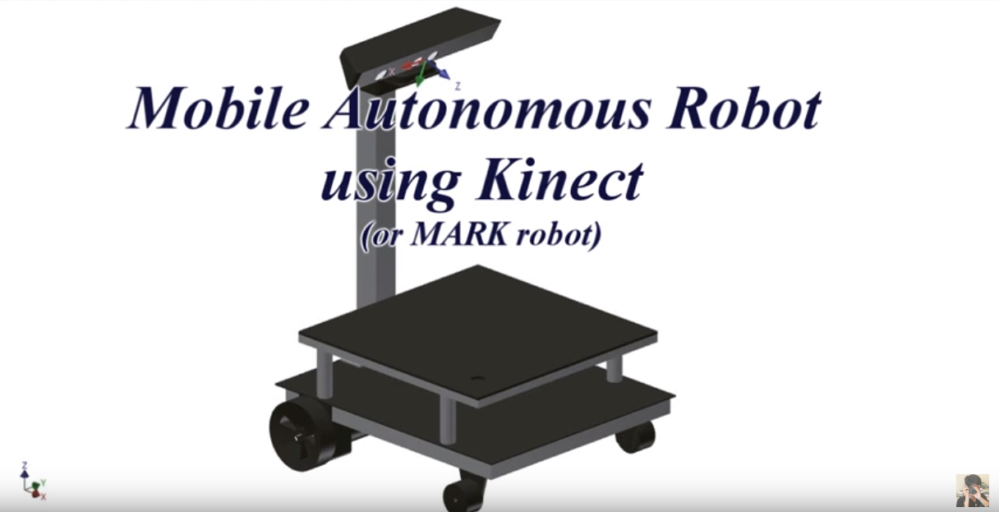

# Kinect Robot
Given a priori knowledge of the environment and the goal position, mobile robot navigation refers to the robot's ability to safely move towards the goal using its knowledge and sensorial information of the surrounding environment. In fact, in mobile robot operating in unstructured environment, the knowledge of the environment is usually absent or partial. Therefore, obstacle detection and avoidance are always mentioned for mobile robot missions.

Kinect is not only normal camera sensor but also a special device can provide depth map.Depth map is acquired through OpenNI library then processed by Point Cloud library to extract accurate information about the environment.

Demo in action: https://www.youtube.com/watch?v=r3DLVdcBmZg

    

